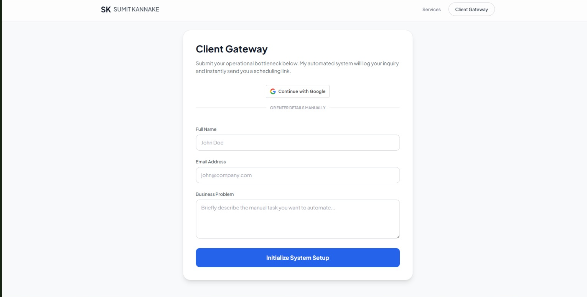
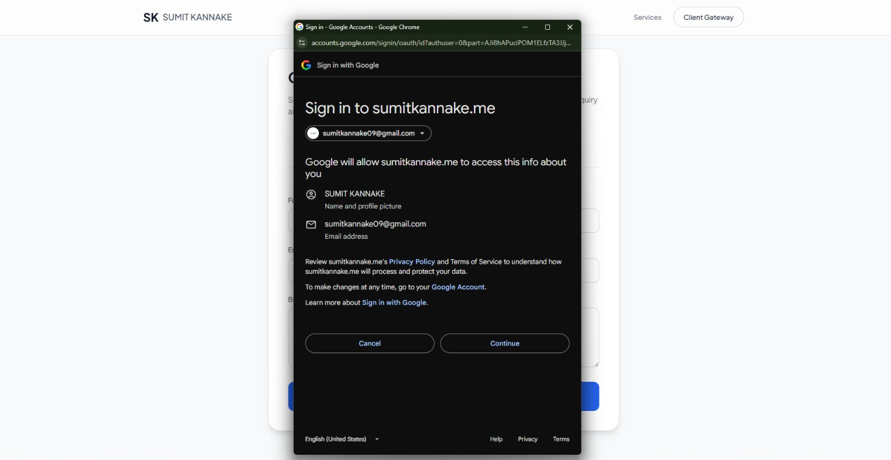
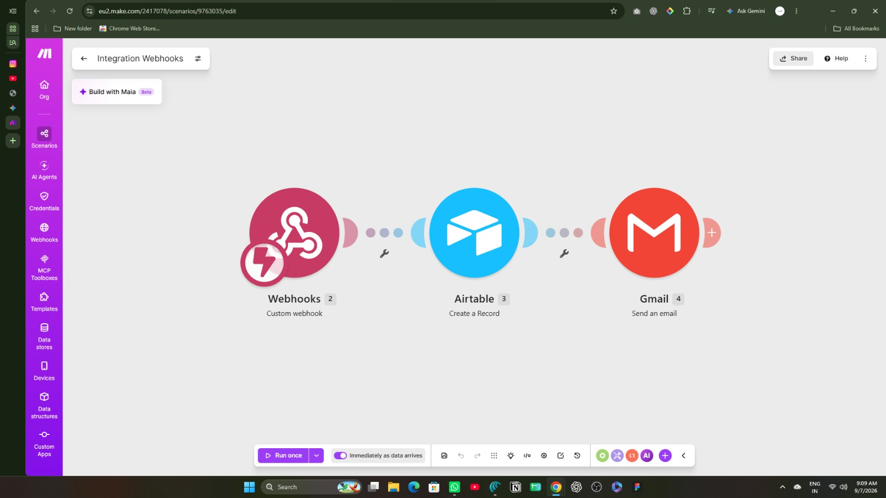
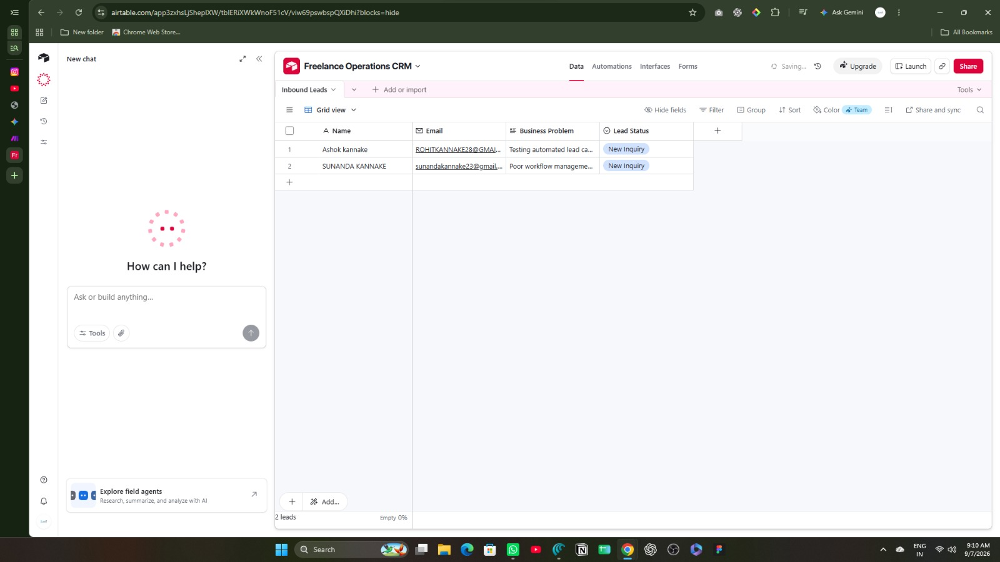

# Serverless Inbound Lead Gateway & CRM Automation Pipeline

> An enterprise-grade, serverless lead capture gateway featuring client-side Google Identity Services (OAuth 2.0), an asynchronous AJAX ingestion mechanism, and an event-driven automation orchestration pipeline syncing records to Airtable and triggering transactional HTML communications.

**Live Gateway**: [sumitkannake.me](https://sumitkannake.me)  
**Author**: Sumit Kannake  
**Role**: Process Automation & Business Analytics Specialist  

---

## 1. Executive Summary & Problem Scope

Traditional website contact forms rely on standard HTTP redirects, create high conversion friction, and frequently ingest invalid or mistyped contact information. In addition, inbound inquiries frequently sit unattended in standard email inboxes rather than being structured immediately into a CRM.

This project implements an end-to-end operational architecture that resolves these bottlenecks:
* **Zero-Redirect Experience**: Frictionless client intake without page reloads using native JavaScript asynchronous `fetch()`.
* **Identity Verification**: One-click Google Identity OAuth 2.0, auto-populating validated lead metadata via client-side JWT decoding.
* **Immediate CRM Synchronization**: Event-driven webhook distribution into an operational relational database within seconds.
* **Instant Client Engagement**: Automated, branded transactional HTML confirmation receipts dispatched via the Gmail API.

---

## 2. System Architecture
```
[ Visitor / Client ]
         │
         ├── Option A: Manual Input (Name, Email, Problem)
         └── Option B: "Continue with Google" (OAuth 2.0 JWT Decoded)
         │
         ▼
[ Asynchronous AJAX Payload (JSON) ]
         │
         ▼
[ Make.com Orchestrator Webhook ]
         │
         ├─────────────────────────────┐
         ▼                             ▼
[ Airtable Operations CRM ]    [ Gmail API Dispatcher ]
(Structured Record Creation)   (Dynamic Transactional HTML)
```
## 3. Implementation Details & Visual Proof

### A. Client Intake Gateway & Google Identity Services (OAuth 2.0)
Integrated Google Identity Services (`gsi/client`) using a secured pop-up authentication flow. The client-side decoder converts base64url JSON Web Tokens (JWT) into verified name and email data, prefilling the form and providing instant visual feedback.





* **Protocol**: OAuth 2.0 Client-Side Flow
* **Security Controls**: Explicit JavaScript Origins mapped to `https://sumitkannake.me` with publishing status configured for Production.

---

### B. Event-Driven Workflow Orchestration (Make.com)
The frontend transmits an asynchronous JSON payload to an edge webhook endpoint. The scenario executes instantaneously upon payload arrival, performing multi-tier data distribution without dedicated server maintenance.



* **Pipeline Stages**:
  1. **Webhooks Module**: Ingestion and parsing of the raw JSON payload.
  2. **Airtable Module**: Automated record creation within the primary CRM database.
  3. **Gmail Module**: Dynamic transactional receipt compilation and dispatch.

---

### C. Relational CRM Database Architecture (Airtable)
Configured the `Freelance Operations CRM` base to structure incoming client requirements, track pipeline lifecycles, and maintain clean database normalization.



* **Field Specifications**:
  - `Name` (Single-line text)
  - `Email` (Email format validation)
  - `Business Problem` (Long text)
  - `Lead Status` (Single Select: `New Inquiry`, `Discovery Scheduled`, `Closed`)

---

## 4. Tech Stack Breakdown

* **Frontend**: HTML5, Tailwind CSS, JavaScript (ES6+ AJAX Fetch & JWT Decoding)
* **Hosting & Edge Delivery**: GitHub, Vercel Edge Network
* **Identity Provider**: Google Cloud Platform (OAuth 2.0)
* **Orchestration**: Make.com
* **Database**: Airtable
* **Transactional Email**: Google Workspace / Gmail API

---

## 5. Key Operational Metrics

* **Intake Latency**: Record logging and client receipt dispatch completed in **< 3 seconds**.
* **Data Accuracy**: 0% email mistype rate when authenticated through Google Identity Services.
* **Server Overhead**: 100% serverless, zero maintenance, and fully operational on free tier allocations.
